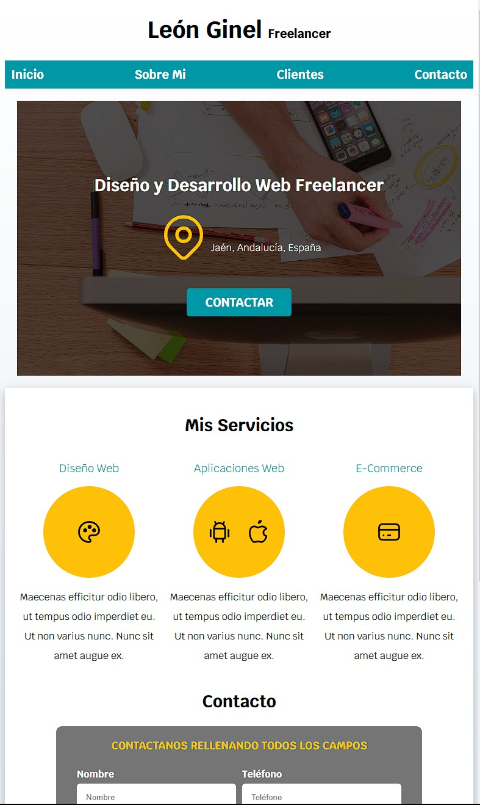

# Simple Freelancer Web Interface

Pequeña interfaz web con una estructura diseñada para una supuesta página personal como freelancer. La web es completamente responsive.

## Tecnologías utilizadas
- **HTML5**: Estructura del contenido
- **CSS3**: Estilos y diseño responsivo

## Enlace
https://leonginelfreelancer.netlify.app

## Capturas de Pantalla

